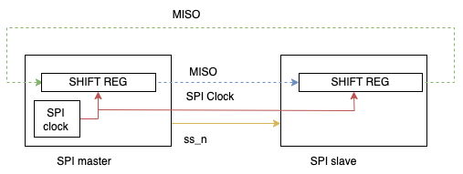
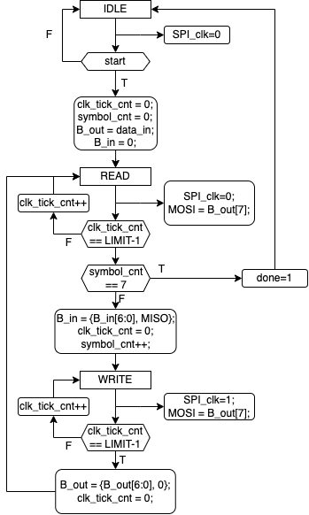
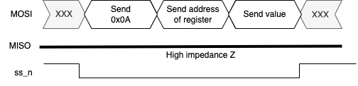
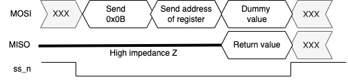

# Second homework -> SPI controller and FProV2 SoC

## Objective

The objective of this homework is to develop a SPI (Serial Peripheral Interface) controller to communicate with an external SPI memory device. You will integrate this controller into the FProV2 SoC (System on Chip) design, allowing the CPU to read from and write to the SPI memory. This involves designing the SPI controller and integrating it on an FPGA board.

## SPI Controller Design

### Introduction to SPI protocol

SPI (Serial Peripheral Interface Bus) is a standard for synchronous serial data communication between electronic devices, primarily integrated circuits. It enables bidirectional (full-duplex) communication and is based on a hierarchical master/slave principle, where the master device initiates and controls the communication with the slave device.

The SPI bus supports bidirectional data transfer with one or more slave devices. For communication, it uses four basic signal lines:

MISO (Master In Slave Out) – the data line through which the slave device sends data to the master,

MOSI (Master Out Slave In) – the data line through which the master device sends data to the slave,

SCK (Serial Clock) – the synchronization signal (clock) generated by the master device,

SS_n (Slave Select) – the signal used to select a slave device; it is active in the low logic state (logic 0 → _n), allowing the master device to determine which slave device it will communicate with.

## SPI Communication Parameters

The parameters CPOL (Clock Polarity) and CPHA (Clock Phase) define the operating mode of the SPI bus with respect to the clock signal. CPOL determines the idle state of the clock signal when no data transfer is taking place (0 = low, 1 = high), while CPHA specifies on which clock edge (leading or trailing) the data is sampled.

The combination of these two parameters defines one of the four SPI modes (Mode 0–3), allowing the communication to be adapted to different devices and ensuring correct data synchronization.

In the figure below, the sampling and generation of signals on the SPI bus are shown for Mode 0 (CPOL = 0, CPHA = 0).

Legend:

a – generation of bit B7 on the MOSI line
b – sampling of bit B7 on the MISO line
c – generation of bit B6 on the MOSI line
d – sampling of bit B6 on the MISO line

## Implementing an SPI Communication Controller

The SPI device controller is based on a simple finite-state machine with three states: IDLE, READ, and WRITE, as shown in the attached figure.

The IDLE state represents the inactive condition when there is no transfer on the SPI bus. When the start signal becomes active, SPI communication begins and the controller transitions to the READ state.

In the READ state, the controller monitors the data, but samples it only at the appropriate time. It counts system clock cycles until half of the SPI clock period has elapsed. At that moment, it samples the input signal and stores it in the input shift register. At the same time, it increments the received-bit counter. If enough bits have been received to complete the transfer, the communication on the SPI bus is terminated. Otherwise, the controller transitions to the WRITE state.

In the WRITE state, the controller drives the output data. Here as well, it counts system clock cycles until half of the SPI period has elapsed. At the end of this interval, the output shift register is updated, and the controller returns to the READ state to continue the communication.

## Integration with FProV2 SoC

Integrate the SPI controller into the FProV2 SoC design, allowing the CPU to read from and write from SPI device. To achieve this, you will need to:
- Implement the SPI controller as described above.
- Add buffer which will be used to store data to be transmitted and data received from the SPI device.
- Add a wrapping circuit for compilance with APB protocol.

### ADXL362 accelerometer

The ADXL362 is a low-power, high-resolution, three-axis MEMS accelerometer from Analog Devices. It enables measurement of both dynamic acceleration caused by motion or shocks and static acceleration caused by gravity. The measurements are internally digitized and stored in internal registers. The device also allows configuration of the measurement range and the data sampling frequency.

The ADXL362 accelerometer is connected to the FPGA device via an SPI interface, with the following connections:

- Pin E15 – MISO (Master In Slave Out)
- Pin F14 – MOSI (Master Out Slave In)
- Pin F15 – SPI clock (SCK) (from 1 to 5 MHz)
- Pin D15 – Chip select (CS_n, active low)

The SPI interface of the accelerometer supports SPI Mode 0.

In addition to the wiring, correct communication also requires knowing the register addresses in the accelerometer. Some important registers are:

- Address 0x02 – ID register (content: 0xF2)
- Address 0x08 – X-axis acceleration register
- Address 0x09 – Y-axis acceleration register
- Address 0x0A – Z-axis acceleration register
- Address 0x2d – Power control register (write 0x02 to start measurements)

More on the ADXL362 can be found in the [datasheet](https://www.analog.com/media/en/technical-documentation/data-sheets/adxl362.pdf).

#### Register Write Sequence

The master device (FPGA) sends the command value 0x0A, which indicates a register write operation.
It then sends the address of the target register. This is followed by the transmission of the data, which is written into the selected register.

If multiple consecutive data bytes are transmitted, the accelerometer automatically increments the register address, allowing sequential writes to subsequent registers.

#### Register Read Sequence

The master device sends the command value 0x0B, which indicates a register read operation.
It then sends the address of the target register. The accelerometer then starts transmitting data over the MISO line. During this time, the master device must transmit “dummy” values on the MOSI line, which are ignored by the accelerometer.

When reading multiple consecutive data bytes, the accelerometer automatically increments the register address, enabling continuous reading of subsequent registers.

## Assignment 

1. Implement the SPI controller as described above.
2. Integrate the SPI controller into the FProV2 SoC design.
3. Write a test program for the CPU that performs the following tasks:
   - Initializes the ADXL362 accelerometer by writing the appropriate value to the power control register.
   - Reads the device ID from the ID register and verifies it matches the expected value (0xF2).
   - Continuously reads acceleration data from the X, Y, and Z axis registers and stores the values in memory.
   - Outputs the acceleration data to a serial terminal via UART for monitoring or on 7-segment display if available.
4. Test the complete system on the FPGA board, ensuring correct operation of the SPI communication and accurate reading of acceleration data from the ADXL362 accelerometer.